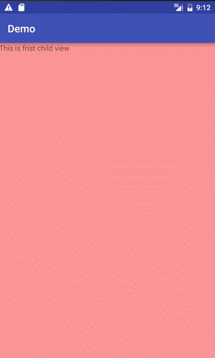

# PullupSeeDetails
一个仿淘宝和京东商品详情上拉查看详情，下拉返回的demo

主要类 SlidingDetailsLayout
具体实现看代码,如果子view 是ListView 或者 ScrollView 这种自带上下内容滚动的View,则需要实现 TopBottomListener 接口 
通过设置 PositionChangListener 来监听当前 SlidingDetailsLayout 的内容状态

如果有什么问题,请留. 代码目前不是很规范 我会抽时间来完善它,以及增加更多的功能

